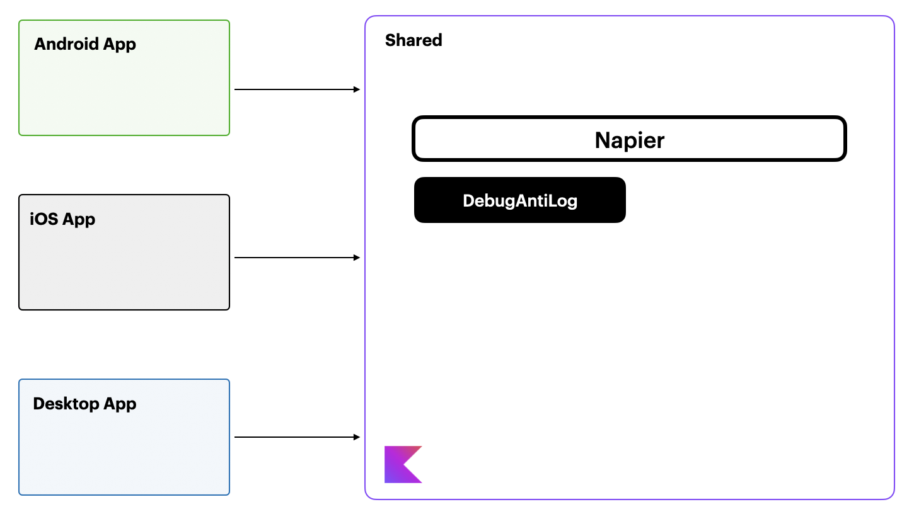
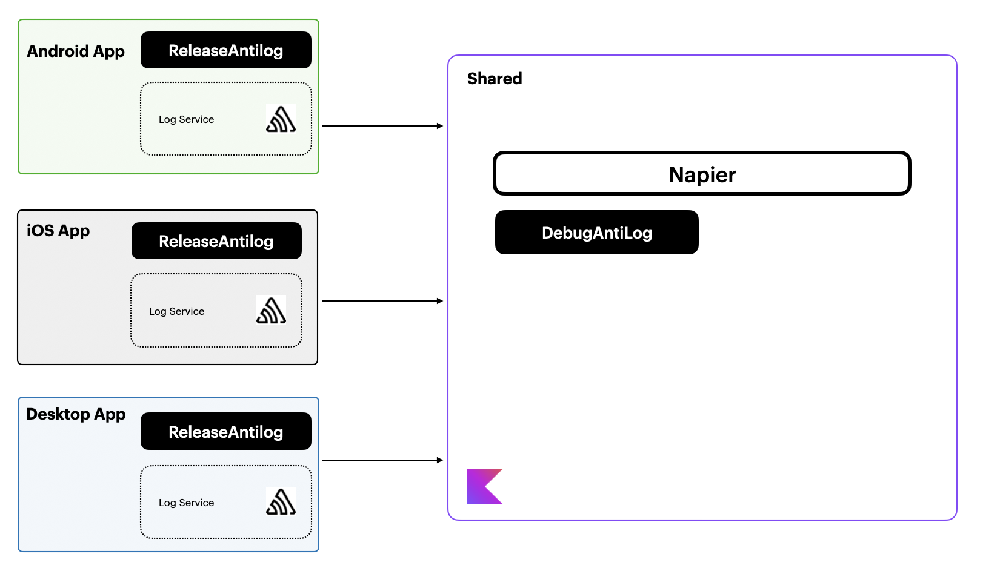

This is a kotlin multiplatform project targeting Android, iOS and Desktop built with the intention to demonstrate how to manage logs on KMP app.

The main branch has the basic setup using [Napier](https://github.com/AAkira/Napier)

Then, you have the [sentry branch](https://github.com/carlosmonzon/LogsSample/tree/sentry) that shows how to best integrate third party logs/crash services for a KMP application extending the Napier functionalities.

There is a full articule around this integration in:

https://blog.thesurfcode.com/logs-management-in-kmp

**Basic integration**

**Final integration**

